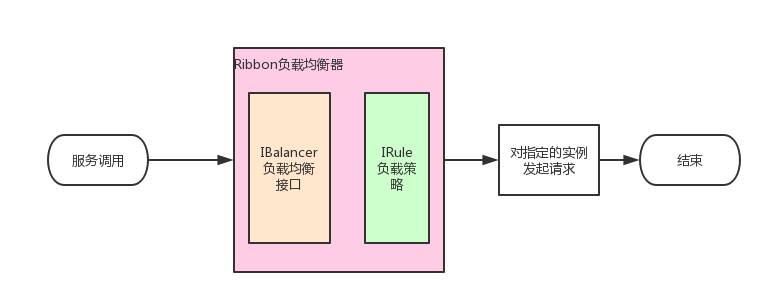
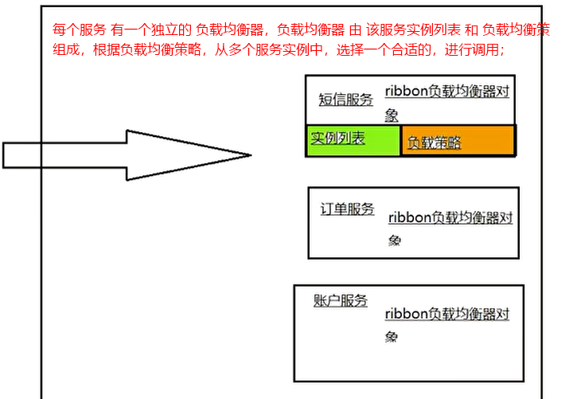

# Ribbon 客户端负载均衡
```text
客户端负载均衡：
一个服务，多个实例，如何选择调用实例？调用实例之前，先去eureka服务端 获取该服务的所有实例，根据Ribbon的负载均衡策略，选择一个合适的实例，然后发起请求调用该实例；
```

## Ribbon 原理
```text
每个服务 都有一个独立的 负载均衡器 ILoadBalancer，ILoadBalancer = 该服务的实例列表 + 负载均衡策略；
List<Server>存 该服务 服务实例列表，数据源于 配置信息ConfigurationBasedServerList 或者 EurekaRibbonClientConfiguration.ribbonServerList；
chooseServer(Object key)：根据负载均衡策略 从多个 服务实例中选择一个合适的实例；
```

## Ribbon 3种配置方式

```yaml
# 3、ribbon通过eureka进行负载均衡；重点：重试方案；
ribbon:
  eureka:
    enabled: true                 # 开启eureka与ribbon的集成
  hystrix: 
    enabled: false                # 暂不开启熔断机制
  ConnectTimeout: 2000            # 配置ribbon默认的超时时间
  ReadTimeout: 2000
  OkToRetryOnAllOperations: true  # 开启重试 重试有 2种情况：一个服务有多个实例，1、始终在一个实例上重试；2、一个实例请求不通，换一个实例再请求；总的超时时间 = (ConnectTimeout + ReadTimeout) * (MaxAutoRetriesNextServer + 1) * (MaxAutoRetries + 1)
  MaxAutoRetriesNextServer: 1     # 重试期间，实例切换次数	 比如：该服务有100个实例，只会在 2个实例上面去重试
  MaxAutoRetries: 0               # 当前实例重试次数
  
```

```text
1、application.yml中直接配置；2、@RibbonClient；3、ribbon与eureka集成使用，ribbon会自动创建负载均衡器，不需要额外配置；
 ```
```yaml
# 1、application.yml中直接配置 负载均衡器；
service-by-properties:            # 请求 service-by-properties服务时，从下面服务列表找
  listOfServers: http://www.csdn.net,http://www.baidu.com,http://www.dongnaoedu.com # 服务实例列表
  MaxAutoRetriesNextServer: 0           # 这个负载均衡器不做重试
  MaxAutoRetries: 0
  ribbon:
    NFLoadBalancerRuleClassName: com.netflix.loadbalancer.RoundRobinRule            # 负载策略
    NIWSServerListClassName: com.netflix.loadbalancer.ConfigurationBasedServerList  # 设置它的服务实例信息来自配置文件, 如果不设置NIWSServerListClassName就会去euereka里面找
```
```java
//启动类使用@RibbonClients注解，service-by-annotation表示服务名
@RibbonClients(value = {@RibbonClient(name = "service-by-annotation", configuration = ServiceByAnnontationConfiguration.class) })
public class RibbonSampleApplication {
    //...
}
/**负载均衡器配置类 = 该服务的 服务实例列表 + 负载均衡策略；注意：子容器 不能加 @Configuration*/
public class ServiceByAnnontationConfiguration {
	// service-by-annotation 服务的实例源
	@Bean
	public ServerList<Server> ribbonServerList() {
		// 实例列表
		String listOfServers = "http://www.csdn.net,http://www.baidu.com,http://www.dongnaoedu.com";
		String[] splits = listOfServers.split(",");
		int len = splits.length;
		if (len == 0) {
			return new StaticServerList<Server>();
		}

		Server[] servers = new Server[len];
		for (int i = 0; i < len; i++) {
			servers[i] = new Server(splits[i].trim());
		}
		return new StaticServerList<Server>(servers);		// 返回这个...静态的
	}

	@Bean
	public IRule iniRule() {            // 负载策略
		return new RandomRule();		// 随机
	}
}
```

## Ribbon 3种使用方式
```text
见 way包：
1、LoadbalancerClient：TestLoadBalancerClientController类，通过LoadbalancerClient对象，选择服务的一个实例，ServiceInstance serviceInstance = loadbalancerClient.choose("service-by-properties")
2、RestTemplate：TestResttemplateController类，通过restTemplate对象，选择服务的一个实例，String body = restTemplate.getForObject("http://service-by-properties/", String.class);
3、Feign：TestFeignController类
```

## Ribbon 源码分析
```text
springboot启动时，会扫描spring-cloud-netflix-core包 META-INF/spring.factories，内容如下：
org.springframework.boot.autoconfigure.EnableAutoConfiguration=\
  org.springframework.cloud.netflix.ribbon.RibbonAutoConfiguration    # Ribbon初始化
spring.factories中这样定义目的：springboot启动时会 自动装配 以EnableAutoConfiguration为key的value，因此EurekaServerAutoConfiguration会被 实例化到当前IOC容器
```

```java
/**1、LoadbalancerClient实现负载均衡
* 
* */
@Configuration
@RibbonClients
public class RibbonAutoConfiguration {
   	@Bean
   	@ConditionalOnMissingBean(LoadBalancerClient.class)
   	public LoadBalancerClient loadBalancerClient() {        
   		return new RibbonLoadBalancerClient(springClientFactory());     //实例化LoadbalancerClient到 IOC容器；跟
   	}
}
public class RibbonLoadBalancerClient implements LoadBalancerClient {
    @Override
    public ServiceInstance choose(String serviceId) {   //一个服务名 有多个实例，选择其中一个 实例
        Server server = getServer(serviceId);   //跟getServer()
        if (server == null) {
            return null;
        }
        return new RibbonServer(serviceId, server, isSecure(server, serviceId),serverIntrospector(serviceId).getMetadata(server));
    }
    protected Server getServer(String serviceId) {
        return getServer(getLoadBalancer(serviceId));       //根据服务名，获取 该服务配置的 负载均衡器，用负载均衡器 选择一个 服务的一个实例；跟 getLoadBalancer(serviceId)
    }
    protected ILoadBalancer getLoadBalancer(String serviceId) {     //每个服务 都有一个 负载均衡器ILoadBalancer，在RibbonClientConfiguration中初始化
        return this.clientFactory.getLoadBalancer(serviceId);
    }
    protected Server getServer(ILoadBalancer loadBalancer) {        //跟 getServer()
        if (loadBalancer == null) {return null;}
        return loadBalancer.chooseServer("default");                //跟 chooseServer("default")
    }
}
@Configuration
@EnableConfigurationProperties
public class RibbonClientConfiguration {
    @Bean
	@ConditionalOnMissingBean
	public ILoadBalancer ribbonLoadBalancer(IClientConfig config,ServerList<Server> serverList, ServerListFilter<Server> serverListFilter,IRule rule, IPing ping, ServerListUpdater serverListUpdater) {
		if (this.propertiesFactory.isSet(ILoadBalancer.class, name)) {
			return this.propertiesFactory.get(ILoadBalancer.class, config, name);
		}
		return new ZoneAwareLoadBalancer<>(config, rule, ping, serverList,serverListFilter, serverListUpdater);
	}
}
public class BaseLoadBalancer extends AbstractLoadBalancer implements PrimeConnections.PrimeConnectionListener, IClientConfigAware {
    public Server chooseServer(Object key) {
        if (counter == null) {
            counter = createCounter();
        }
        counter.increment();
        if (rule == null) {
            return null;
        } else {
            try {
                return rule.choose(key);        //根据负载策略 去选择
            } catch (Exception e) {}
        }
    }
    @Override
    public List<Server> getAllServers() {                       //  获取服务实例来源
        return Collections.unmodifiableList(allServerList);
    }
    public void setServersList(List lsrv) {                     //  将服务实例设置进来，调用该方法的位置如下
        //...
    }
}
@Configuration
public class RibbonClientConfiguration {
	@Bean
	@ConditionalOnMissingBean
	public ServerList<Server> ribbonServerList(IClientConfig config) {      // 设置服务实例
		if (this.propertiesFactory.isSet(ServerList.class, name)) {
			return this.propertiesFactory.get(ServerList.class, config, name);
		}
		// ConfigurationBasedServerList 父类 AbstractServerList还有一个子类 DiscoveryEnabledNIWSServerList，表示通过 eureka获取服务实例信息
		ConfigurationBasedServerList serverList = new ConfigurationBasedServerList();
		serverList.initWithNiwsConfig(config);
		return serverList;
	}
}
```
