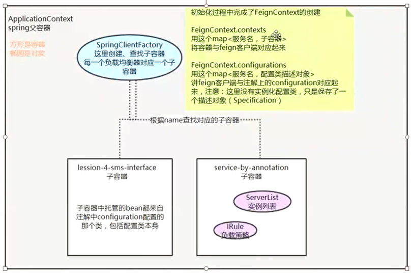

# Ribbon 客户端负载均衡
>* 注意：nginx属于 服务端负载均衡，可以一起使用，不冲突；客户端指发送http请求，服务端指接收http请求
```text
Ribbon作用简介：
一个服务，多个实例，如何选择调用实例？调用实例之前，先去eureka服务端 获取该服务的所有实例，根据Ribbon的负载均衡策略，选择一个合适的实例，然后发起请求调用该实例；
```

## Ribbon 原理
```text
每个服务 都有一个独立的 负载均衡器 ILoadBalancer，ILoadBalancer = 该服务的实例列表 + 负载均衡策略 IRule；
List<Server>存 该服务 服务实例列表，数据源于 配置信息ConfigurationBasedServerList 或者 EurekaRibbonClientConfiguration.ribbonServerList；
chooseServer(Object key)：根据负载均衡策略 从多个 服务实例中选择一个合适的实例；
```

```java
@SpringBootApplication
@EnableEurekaClient
@EnableFeignClients
public class RibbonSampleApplication {

	public static void main(String[] args) {
		new SpringApplicationBuilder(RibbonSampleApplication.class).web(true).run(args);
	}

    /** 配置 负载均衡器 ILoadBalancer 的负载均衡规则 IRule
    * @SpringBootApplication 中含有 @Configuration，@Configuration + @Bean 会实例化到 父容器；不加@Configuration，只用@Bean会实例化到 子容器
    * 子容器可以获取到父容器里面的对象，父容器不能获取子容器里面的对象
    * */
	 @Bean
	 public IRule ribbonRule() {
	    return new RandomRule();
	 }
}
```
```text
Spring父子容器：每个服务 都有一个独立的 负载均衡器 ILoadBalancer，各个负载均衡器ILoadBalancer 怎么样独立 自己的配置呢？ 答案：Spring有很多子容器，每个子容器保存一个服务的负载均衡器配置；
```

## Ribbon 3种配置方式

```text
1、application.yml中直接配置；2、@RibbonClient；3、ribbon与eureka集成使用，ribbon会自动创建负载均衡器，不需要额外配置；
 ```
 
```yaml
# 3、ribbon通过eureka进行负载均衡；重点：重试方案；
ribbon:
  eureka:
    enabled: true                 # 开启eureka与ribbon的集成
  hystrix: 
    enabled: false                # 暂不开启熔断机制
  ConnectTimeout: 2000            # 配置ribbon默认的超时时间
  ReadTimeout: 2000
  OkToRetryOnAllOperations: true  # 开启重试 重试有 2种情况：一个服务有多个实例，1、始终在一个实例上重试；2、一个实例请求不通，换一个实例再请求；总的超时时间 = (ConnectTimeout + ReadTimeout) * (MaxAutoRetriesNextServer + 1) * (MaxAutoRetries + 1)
  MaxAutoRetriesNextServer: 1     # 重试期间，实例切换次数	 比如：该服务有100个实例，只会在 2个实例上面去重试
  MaxAutoRetries: 0               # 当前实例重试次数
  
```

```yaml
# 1、application.yml中直接配置 负载均衡器；
service-by-properties:            # 请求 service-by-properties服务时，从下面服务列表找
  listOfServers: http://www.csdn.net,http://www.baidu.com,http://www.dongnaoedu.com # 服务实例列表
  MaxAutoRetriesNextServer: 0           # 这个负载均衡器不做重试
  MaxAutoRetries: 0
  ribbon:
    NFLoadBalancerRuleClassName: com.netflix.loadbalancer.RoundRobinRule            # 负载策略
    NIWSServerListClassName: com.netflix.loadbalancer.ConfigurationBasedServerList  # 设置它的服务实例信息来自配置文件, 如果不设置NIWSServerListClassName就会去euereka里面找
```
```java
//启动类使用@RibbonClients注解，service-by-annotation表示服务名
@RibbonClients(value = {@RibbonClient(name = "service-by-annotation", configuration = ServiceByAnnontationConfiguration.class) })
public class RibbonSampleApplication {
    //...
}
/**负载均衡器配置类 = 该服务的 服务实例列表 + 负载均衡策略；注意：子容器 不能加 @Configuration*/
public class ServiceByAnnontationConfiguration {
	// service-by-annotation 服务的实例源
	@Bean
	public ServerList<Server> ribbonServerList() {
		// 实例列表
		String listOfServers = "http://www.csdn.net,http://www.baidu.com,http://www.dongnaoedu.com";
		String[] splits = listOfServers.split(",");
		int len = splits.length;
		if (len == 0) {
			return new StaticServerList<Server>();
		}

		Server[] servers = new Server[len];
		for (int i = 0; i < len; i++) {
			servers[i] = new Server(splits[i].trim());
		}
		return new StaticServerList<Server>(servers);		// 返回这个...静态的
	}

	@Bean
	public IRule iniRule() {            // 负载策略
		return new RandomRule();		// 随机
	}
}
```

## Ribbon 3种使用方式
```text
见 way包：
1、LoadbalancerClient：TestLoadBalancerClientController类，通过LoadbalancerClient对象，选择服务的一个实例，ServiceInstance serviceInstance = loadbalancerClient.choose("service-by-properties")
2、RestTemplate：TestResttemplateController类，通过restTemplate对象，选择服务的一个实例，String body = restTemplate.getForObject("http://service-by-properties/", String.class);
3、Feign：TestFeignController类
```

## Ribbon 源码分析
```text
springboot启动时，会扫描spring-cloud-netflix-core包 META-INF/spring.factories，内容如下：
org.springframework.boot.autoconfigure.EnableAutoConfiguration=\
  org.springframework.cloud.netflix.ribbon.RibbonAutoConfiguration    # Ribbon初始化
spring.factories中这样定义目的：springboot启动时会 自动装配 以EnableAutoConfiguration为key的value，因此EurekaServerAutoConfiguration会被 实例化到当前IOC容器
```
### Ribbon 源码分析：RibbonLoadBalancerClient 实现 负载均衡原理
```java
/**实例化 spring-cloud-netflix-core包中类到 当前 IOC容器*/
@Configuration
@RibbonClients
public class RibbonAutoConfiguration {
   	@Bean
   	@ConditionalOnMissingBean(LoadBalancerClient.class)
   	public LoadBalancerClient loadBalancerClient() {        
   		return new RibbonLoadBalancerClient(springClientFactory());     //跟；实例化LoadbalancerClient到 IOC容器
   	}
   	@Bean
    public SpringClientFactory springClientFactory() {                  //SpringClientFactory负责创建 和 查找 子容器
        SpringClientFactory factory = new SpringClientFactory();
        factory.setConfigurations(this.configurations);
        return factory;
    }
}
public class RibbonLoadBalancerClient implements LoadBalancerClient {
    @Override
    public ServiceInstance choose(String serviceId) {   //一个服务名 有多个实例，选择其中一个 实例
        Server server = getServer(serviceId);   //跟getServer()
        if (server == null) {
            return null;
        }
        return new RibbonServer(serviceId, server, isSecure(server, serviceId),serverIntrospector(serviceId).getMetadata(server));
    }
    protected Server getServer(String serviceId) {
        return getServer(getLoadBalancer(serviceId));       //根据服务名，获取 该服务配置的 负载均衡器，用负载均衡器 选择一个 服务的一个实例；跟 getLoadBalancer(serviceId)
    }
    protected ILoadBalancer getLoadBalancer(String serviceId) {     //每个服务 都有一个 负载均衡器ILoadBalancer，在RibbonClientConfiguration中初始化
        return this.clientFactory.getLoadBalancer(serviceId);
    }
    protected Server getServer(ILoadBalancer loadBalancer) {        //跟 getServer()
        if (loadBalancer == null) {return null;}
        return loadBalancer.chooseServer("default");                //跟 chooseServer("default")，loadBalancer通过下面的ribbonLoadBalancer()方法 实例化到IOC容器
    }
}
@Configuration
@EnableConfigurationProperties
public class RibbonClientConfiguration {
    @Bean
	@ConditionalOnMissingBean
	public ILoadBalancer ribbonLoadBalancer(IClientConfig config,ServerList<Server> serverList, ServerListFilter<Server> serverListFilter,IRule rule, IPing ping, ServerListUpdater serverListUpdater) {
		if (this.propertiesFactory.isSet(ILoadBalancer.class, name)) {
			return this.propertiesFactory.get(ILoadBalancer.class, config, name);
		}
		return new ZoneAwareLoadBalancer<>(config, rule, ping, serverList,serverListFilter, serverListUpdater);
	}
}
/**BaseLoadBalancer是 ILoadBalancer接口的一个默认实现类*/
public class BaseLoadBalancer extends AbstractLoadBalancer implements PrimeConnections.PrimeConnectionListener, IClientConfigAware {
    public Server chooseServer(Object key) {
        if (counter == null) {
            counter = createCounter();
        }
        counter.increment();
        if (rule == null) {
            return null;
        } else {
            try {
                return rule.choose(key);        //持有 IRule接口对象，根据负载策略 去选择服务实例
            } catch (Exception e) {}
        }
    }
    @Override
    public List<Server> getAllServers() {                       //  获取服务实例列表
        return Collections.unmodifiableList(allServerList);
    }
    public void setServersList(List lsrv) {                     //  将服务实例设置进来，lsrv由ribbonServerList()实例化到 IOC容器
        //...
    }
}
@Configuration
public class RibbonClientConfiguration {
	@Bean
	@ConditionalOnMissingBean
	public ServerList<Server> ribbonServerList(IClientConfig config) {      // 设置服务实例
		if (this.propertiesFactory.isSet(ServerList.class, name)) {
			return this.propertiesFactory.get(ServerList.class, config, name);
		}
		// ConfigurationBasedServerList 父类 AbstractServerList还有一个子类 DiscoveryEnabledNIWSServerList，表示通过 eureka获取服务实例信息
		ConfigurationBasedServerList serverList = new ConfigurationBasedServerList();
		serverList.initWithNiwsConfig(config);
		return serverList;
	}
}
/**使用 SpringClientFactory创建 子容器并 根据名称查找子容器*/
public class RibbonLoadBalancerClient implements LoadBalancerClient {
    public RibbonLoadBalancerClient(SpringClientFactory clientFactory) {
        this.clientFactory = clientFactory;
    }
    @Override
    public URI reconstructURI(ServiceInstance instance, URI original) {
        String serviceId = instance.getServiceId();     //serviceId为服务名
        RibbonLoadBalancerContext context = this.clientFactory.getLoadBalancerContext(serviceId);   //跟；通过 服务名查找 子容器
        IClientConfig clientConfig = clientFactory.getClientConfig(serviceId);      //根据服务名称 获取 该服务的负载均衡器配置信息
    }
}
public class SpringClientFactory extends NamedContextFactory<RibbonClientSpecification> {
	public RibbonLoadBalancerContext getLoadBalancerContext(String serviceId) {
		return getInstance(serviceId, RibbonLoadBalancerContext.class);     //跟
	}
	@Override
    public <C> C getInstance(String name, Class<C> type) {
        C instance = super.getInstance(name, type);                     //super.getInstance(name, type)
        //...
    }
}
public abstract class NamedContextFactory<C extends NamedContextFactory.Specification> implements DisposableBean, ApplicationContextAware {
    public <T> T getInstance(String name, Class<T> type) {
		AnnotationConfigApplicationContext context = getContext(name);          //跟getContext(name)
		//...
	}
	protected AnnotationConfigApplicationContext getContext(String name) {
        if (!this.contexts.containsKey(name)) {
            synchronized (this.contexts) {
                if (!this.contexts.containsKey(name)) {
                    this.contexts.put(name, createContext(name));       //跟createContext(name)
                }
            }
        }
        return this.contexts.get(name);
    }
    protected AnnotationConfigApplicationContext createContext(String name) {
        AnnotationConfigApplicationContext context = new AnnotationConfigApplicationContext();      //创建一个上下文
        if (this.configurations.containsKey(name)) {
            for (Class<?> configuration : this.configurations.get(name)
                    .getConfiguration()) {
                context.register(configuration);        //向上下文 注册 配置信息
            }
        }
        //...
        context.register(PropertyPlaceholderAutoConfiguration.class, this.defaultConfigType);
        context.getEnvironment().getPropertySources().addFirst(new MapPropertySource(this.propertySourceName, Collections.<String, Object> singletonMap(this.propertyName, name)));
        if (this.parent != null) {
            context.setParent(this.parent);             //设置 父上下文 ApplicationContext
        }
        context.refresh();                              //所有上下文必须调用 refresh()，refresh()刷新后，上下文才可以使用
        return context;
    }
}
```

### Ribbon 源码分析：RestTemplate 实现 负载均衡原理
```java
/**RestTemplate 加 @LoadBalanced注解 给RestTemplate调用增加负载均衡功能*/
@RestController
@RequestMapping("/resttemplate")
@Configuration
public class TestResttemplateController {

	@Bean
	@LoadBalanced	/**@Bean表示将RestTemplate 实例化到IOC容器，+@LoadBalanced表示 将IOC容器中RestTemplate实例 加入一个List集合*/
	RestTemplate RestTemplate() {
		SimpleClientHttpRequestFactory simpleClientHttpRequestFactory = new SimpleClientHttpRequestFactory();
		simpleClientHttpRequestFactory.setReadTimeout(2000);
		simpleClientHttpRequestFactory.setConnectTimeout(2000);
		return new RestTemplate(simpleClientHttpRequestFactory);
	}
}
/**LoadBalancerAutoConfiguration在spring.factories中key为 EnableAutoConfiguration*/
@Configuration
@ConditionalOnClass(RestTemplate.class)
@ConditionalOnBean(LoadBalancerClient.class)
@EnableConfigurationProperties(LoadBalancerRetryProperties.class)
public class LoadBalancerAutoConfiguration {

	@LoadBalanced                   /**@Autowired 表示注入RestTemplate实例，+@LoadBalanced 表示 注入 IOC容器中 RestTemplate的List集合*/
	@Autowired(required = false)
	private List<RestTemplate> restTemplates = Collections.emptyList();
	
}
```

### Ribbon 源码分析：FeignClient 实现 负载均衡原理
```java
@ConditionalOnClass({ ILoadBalancer.class, Feign.class })
@Configuration
@AutoConfigureBefore(FeignAutoConfiguration.class)
public class FeignRibbonClientAutoConfiguration {
    @Bean
    @ConditionalOnMissingBean
    public Client feignClient(CachingSpringLoadBalancerFactory cachingFactory,SpringClientFactory clientFactory) {
        return new LoadBalancerFeignClient(new Client.Default(null, null),cachingFactory, clientFactory);
    }
}
class FeignClientFactoryBean implements FactoryBean<Object>, InitializingBean,ApplicationContextAware {
    @Override
    public Object getObject() throws Exception {
        if (!StringUtils.hasText(this.url)) {
            return loadBalance(builder, context, new HardCodedTarget<>(this.type,this.name, url));      //跟loadBalance()
        }    		
    }
    protected <T> T loadBalance(Feign.Builder builder, FeignContext context,HardCodedTarget<T> target) {
        Client client = getOptional(context, Client.class);     //跟getOptional(context, Client.class)
    }
    protected <T> T getOptional(FeignContext context, Class<T> type) {
        return context.getInstance(this.name, type);            //在子容器找到 对应的 FeignClient
    }
}
```
