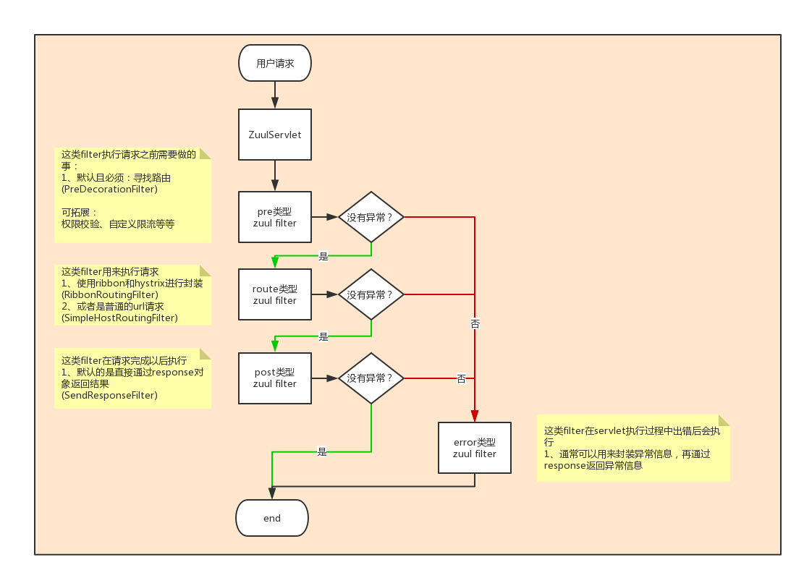
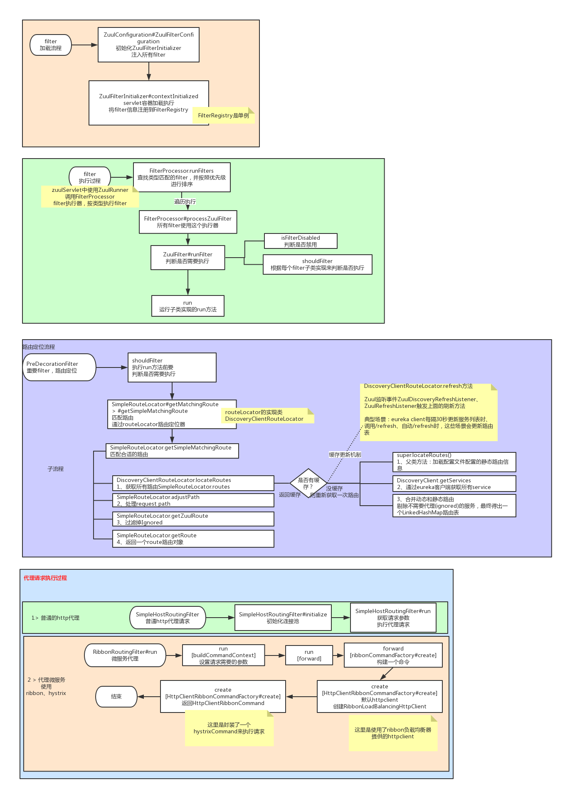

# 服务网关 Zuul
## Zuul基本概念：
```text
什么是API 网关？
    服务实例接口不对外开放，外部调用springcloud中的服务，需要通过 统一入口 网关来映射；
网关工作原理：
    网关解析uri请求，找到相匹配的服务，然后发起调用，取得结果后，将结果返回给调用者[类似Ngix反向代理]；
    zuulServlet 受理用户请求；
    zuulFilter 做路由定位，发起代理请求，返回结果；
为什么需要 网关？
    降低 微服务系统复杂性：网关给外部http请求 统一入口，使外部http请求与微服务内部服务实例解耦；
功能增强：
    附加如 权限校验，限速等机制；
路由表：
    路由表就是在 注册表 上面增加加一列 外部path，当外部请求 http://网关ip:网关port/path 时，path映射到 服务A，从而调用服务A下面的接口
    服务名         instanceid                  ip                  port        外部path
    A              A192.168.25.100:8761       192.168.25.100       8761        a
    A              A192.168.25.101:8762       192.168.25.101       8762        a
    A              A192.168.25.102:8763       192.168.25.102       8763        a
路由定位器：
    将用户请求的path 与 路由表匹配，得到一个路由：外部path →映射到→ 服务名；
```
## 服务准备：
```text
启动 lesson-6-eureka，lesson-6-config-server作为 config服务端，lesson-6-sms-interface，发送get请求 http://localhost:9002/sms 测试 短信服务lesson-6-sms-interface，该服务不应该对外暴露接口，这个服务接口
属于内网，因此需要使用网关代理；
启动 lesson-6-zuul-server作为网关，启动类使用@EnableZuulProxy表示开启 网关zuul，配置文件 lesson-6-zuul-server.yml在config服务端 lesson-6-config-server的resoureces路径下；
```
## zuul配置 路由的 3种方式
```text
① 普通url请求路由配置；反向代理模式：不直接访问一个网址，而是通过一个服务器去访问；为静态路由：   路由服务端口
② eureka动态路由，不需要在配置文件中指定，例如http://localhost:8765/tony_api/lesson-6-sms-interface/sms，外部请求lesson-6-sms-interface/sms 可以直接访问到lesson-6-sms-interface服务的 /sms接口；
③ ribbon路由配置，为静态路由；
```

```yaml
# ①普通url路由配置，在lesson-6-zuul-server.yml文件中，将外部请求path 路由到 内部实例url；只配routes还不够，还要配路由过期时间；
# 测试静态配置，访问zuul服务，发送get请求 http://localhost:8765/tony_api/oschina
zuul:
  host:                             # 代理普通http请求的超时时间
    socket-timeout-millis: 2000
    connect-timeout-millis: 1000
    maxTotalConnections: 200        # http连接池大小
    maxPerRouteConnections: 20      # 每个host最大连接数
  routes:
    route1:                         # 路由key，将外部path 路由到 内部实例url；路由key名称自己随便定义；
      path: /oschina/**             # 外部path
      url: http://www.baidu.com     # 内部服务url
```
```yaml
# ②动态路由：不需要在 配置文件中配置，通过eureka直接路由，如果某个服务想屏蔽外部path路由，可以配置 ignored-services；
# 动态路由指与eureka集成的：lesson-6-sms-interface不对外开放接口，要想访问这个服务必须通过网关 zuul，发送get请求 http://localhost:8765/tony_api/lesson-6-sms-interface/sms 有返回值；路由是eureka中获取的，直接将 路径/lesson-6-sms-interface路由到 服务lesson-6-sms-interface；
zuul:
  ignored-services: lesson-6-sms-interface
```

```yaml
# ③ribbon路由配置，在lesson-6-zuul-server.yml文件中；
# 测试Ribbon配置，访问zuul服务，发送get请求 http://localhost:8765/tony_api/service-by-ribbon
zuul:
    route-service-by-ribbon:        # 路由key，将外部path 路由到 内部实例serviceId；路由key名称自己随便定义；
      path: /service-by-ribbon/**   # 外部path；
      serviceId: service-by-ribbon  # 内部服务；服务信息是通过ribbon负载均衡器配置的；
# service-by-ribbon服务配置，在lesson-6-zuul-server.yml文件中；
service-by-ribbon:                                                                          # 服务名称
  listOfServers: http://www.csdn.net,http://www.baidu.com,http://www.dongnaoedu.com         # 服务实例列表
  ribbon:
    NFLoadBalancerRuleClassName: com.netflix.loadbalancer.RandomRule                        # 负载策略
    NIWSServerListClassName: com.netflix.loadbalancer.ConfigurationBasedServerList          # 设置它的服务实例信息来自配置文件, 而不是euereka
```
## zuul路由 动态刷新：
```text
a eureka会自动维护；
b 配置文件中的静态路由，修改 config-server服务中或者远程仓库中 lesson-6-zuul-server.yml文件中路由设置，然后发送post请求http://localhost:8765/refresh，其
中8765为lesson-6-zuul-server服务的端口，访问lesson-6-zuul-server服务的 /refresh端点，可以动态更新配置，不需要重启lesson-6-zuul-server服务；
```
##　zuul网关的 hystrix降级策略 的配置：
```text
1、Zuul默认集成 hystrix + ribbon，并 依赖eureka 对服务进行调用；注意超时时间的配置，包括ribbon超时和hystrix超时，配置在 lesson-6-zuul-server.yml文件中；
2、实现 ZuulFallbackProvider接口，为网关请求 提供降级方法；
```
```java
/**网关Zuul默认 hystrix降级类
* 测试：http://localhost:8765/tony_api/lesson-6-sms-interface/hystrix/timeout，请求超时调用降级方法 fallbackResponse()
* */
@Component
public class DefaultFallbackProvider implements ZuulFallbackProvider{
	@Override
	public String getRoute() {
		return "*";         // *表示为所有 网关请求 提供降级方法，a表示只为 请求服务a的网关请求 提供降级方法
	}
	/**请求路由发生错误时，给请求的响应信息*/
	@Override
	public ClientHttpResponse fallbackResponse() {
		return new ClientHttpResponse() {
			
			@Override
			public HttpHeaders getHeaders() {
				HttpHeaders headers = new HttpHeaders();                                //设置 返回头信息
                return headers;
			}
			
			@Override
			public InputStream getBody() throws IOException {
				return new ByteArrayInputStream("hystrix发现有问题啦".getBytes());        //设置 返回内容
			}
			
			@Override
			public String getStatusText() throws IOException {
				return "服务有问题啦";
			}
			
			@Override
			public HttpStatus getStatusCode() throws IOException {
				return HttpStatus.BAD_GATEWAY;                                          // 设置 返回码
			}
			
			@Override
			public int getRawStatusCode() throws IOException {
				return 502;
			}
		};
	}
}
```
```yaml
#当请求超时的时候，要对服务进行降级，见com.dongnaoedu.springcloud.zuul.DefaultFallbackProvider类，该类实现ZuulFallbackProvider接口；
#测试 访问lesson-6-sms-interface服务的 TestController#timeOut()方法，即 http://localhost:8765/tony_api/lesson-6-sms-interface/hystrix/timeout，设置2s超时，该请求3s钟才会响应，因此当请求超过 2s时，会调用DefaultFallbackProvider类，返回降级结果；
hystrix:
  command:
    default:                                    # 这是默认的配置
      execution:
        timeout:
          enabled: true
        isolation:
          thread:
            timeoutInMilliseconds: 2000         # 命令执行超时时间
ribbon:
  ConnectTimeout: 1000                          # 配置ribbon默认的超时时间
  ReadTimeout: 2000
  OkToRetryOnAllOperations: true                # 是否开启重试
  MaxAutoRetriesNextServer: 1                   # 重试期间，实例切换次数
  MaxAutoRetries: 0                             # 当前实例重试次数
```
## zuul执行流程
```text
DispatcherServlet#doDispatch() → DispatcherServlet#getHandler() → AbstractHandlerMapping#getHandler() → AbstractUrlHandlerMapping#getHandlerInternal() → ZuulHandlerMapping#lookupHandler() → 
AbstractUrlHandlerMapping#lookupHandler()，至此 找到了 handler，所有外部 path都映射到同一个 handler即ZuulController；
ZuulController#handleRequest() → ServletWrappingController#handleRequestInternal() → ZuulServlet#service()，ZuulController将请求(req,resp)交给 ZuulServlet.service(req,resp)处理；
1、ZuulServlet.service() 受理所有 网关请求path，service()方法里 调用4个方法 preRoute() route() postRoute() error(e)；
2、preRoute()：调用所有 pre类型的 ZuulFilter的runFilter()方法，这些方法主要负责 寻找路由，权限校验，限流；
3、route()：调用所有 route类型的 ZuulFilter的runFilter()方法，这个方法负责 根据外部path 调用内部 相应服务；
4、postRoute()：调用所有 post类型的 ZuulFilter的runFilter()方法，这些方法主要负责 处理 Response；
5、error()：调用所有 error类型的 ZuulFilter的runFilter()方法，这些方法主要负责 返回异常；
注意：以上各种类型的 ZuulFilter怎么来的？启动SpringBoot时，会自动装配到 当前项目的 IOC容器中；
注意：实现 Controller接口 与使用 @Controller作用相同，ZuulController就实现了Contrller接口，但是Controller接口不推荐使用；
```


## zuul原理
```text
路由结构：
zuul:
  route01:                  # 路由key
    path：/oschina/*        # 外部path
    serviceId: sms-service  # 内部服务名称

网关中两个重要概念：
1 路由：外部path 与 内部服务 的对应关系，不是精确对应，包含模糊匹配；
2 路由定位器 RouteLocator：将外部path 与 路由表匹配，得到一个路由；
3 zuulServlet：受理外部path；
4 zuulFilter：使用路由定位器实现路由定位，发起代理请求，返回结果；
```


## zuulFilter 加载，执行流程：


```java
/**Filter加载过程：@EnableZuulProxy表示自动装配 Zuul包中的类 到当前IOC容器*/
@SpringBootApplication
@EnableZuulProxy
public class ZuulApplication {
    //...
}

@EnableCircuitBreaker
@EnableDiscoveryClient
@Target(ElementType.TYPE)
@Retention(RetentionPolicy.RUNTIME)
@Import(ZuulProxyConfiguration.class)   //跟ZuulProxyConfiguration；@Import表示将ZuulProxyConfiguration导入 IOC容器；
public @interface EnableZuulProxy {
}

@Configuration
public class ZuulProxyConfiguration extends ZuulConfiguration {}    //ZuulProxyConfiguration实例化之前，必须先实例化其父类ZuulConfiguration，跟ZuulConfiguration

@Configuration
@EnableConfigurationProperties({ ZuulProperties.class })
@ConditionalOnClass(ZuulServlet.class)
@Import(ServerPropertiesAutoConfiguration.class)
public class ZuulConfiguration {
    @Bean
    public ZuulController zuulController() {
        return new ZuulController();                        //ZuulController 实现Controller接口，DispatcherServlet寻找Controller类作为 handler，就会找到这个ZuulController
    }
    @Bean
    public ServletDetectionFilter servletDetectionFilter() {
        return new ServletDetectionFilter();                //装配 各种Filter到 当前IOC容器
    }
}
//看完父类 ZuulProxyConfiguration，再看自己 ZuulProxyConfiguration
@Configuration
public class ZuulProxyConfiguration extends ZuulConfiguration {
    @Bean
    public PreDecorationFilter preDecorationFilter(RouteLocator routeLocator, ProxyRequestHelper proxyRequestHelper) {      //装配 各种类型Filter到 IOC容器
        return new PreDecorationFilter(routeLocator, this.server.getServletPrefix(), this.zuulProperties,proxyRequestHelper);
    }
}
```
```java
/**Filter执行过程*/
public class ZuulServlet{
    @Override
    public void service(javax.servlet.ServletRequest servletRequest, javax.servlet.ServletResponse servletResponse) throws ServletException, IOException {
        preRoute();     //跟；从IOC容器中获取 所有 pre类型的 ZuulFilter，然后触发其过滤方法 ZuulFilter#runFilter()
        route();     
        postRoute();     
        error();
    }
    void preRoute() throws ZuulException {
        zuulRunner.preRoute();     //跟 
    }
}
public class FilterProcessor {
    public Object runFilters(String sType) throws Throwable {
        boolean bResult = false;
        List<ZuulFilter> list = FilterLoader.getInstance().getFiltersByType(sType);     //从IOC容器中 获取所有 pre 类型的 ZuulFilter
        if (list != null) {
            for (int i = 0; i < list.size(); i++) {
                ZuulFilter zuulFilter = list.get(i);
                Object result = processZuulFilter(zuulFilter);                          //zuulFilter.runFilter() 触发zuulFilter
                if (result != null && result instanceof Boolean) {
                    bResult |= ((Boolean) result);
                }
            }
        }
        return bResult;
    }
}
```

```java
/**3、路由定位流程
* 所有请求过来后，都要经过路由定位 PreDecorationFilter，将外部path 映射到 内部服务；
* 测试：发送get请求 http://localhost:8765/tony_api/oschina/
* 自定义 ZuulFilter：继承ZuulFilter，覆写shouldFilter()和run()方法；shouldFilter()方法用于判断这个filter是否需要执行，返回true则执行run()方法，run()方法用于执行这个filter
* */
public class PreDecorationFilter extends ZuulFilter {
    @Override
    public boolean shouldFilter() {                                                     //判断这个filter是否需要执行
        RequestContext ctx = RequestContext.getCurrentContext();
        return !ctx.containsKey(FORWARD_TO_KEY) && !ctx.containsKey(SERVICE_ID_KEY); 
    }
    @Override
    public Object run() {
        RequestContext ctx = RequestContext.getCurrentContext();                                    //RequestContext.getCurrentContext();是线程变量
        final String requestURI = this.urlPathHelper.getPathWithinApplication(ctx.getRequest());    //解析请求，此处返回requestURI = /tony_api/oschina/
        //路由定位器routeLocator，根据路外部path配服务getMatchingRoute(requestURI)，返回路由对象 Route，里面封装Route如下：路由key，外部path，内部服务，路由即外部path和内部服务的映射关系
        //Route(id=route1,fullPath=/tony_api/oschina/,location="http://www.dongnaoedu.com")，其中location为路由的地址，!= null表示可以请求；
        Route route = this.routeLocator.getMatchingRoute(requestURI);
        if (route != null) {
            String location = route.getLocation();
            if (location != null) {
               //...
                if (location.startsWith(HTTP_SCHEME+":") || location.startsWith(HTTPS_SCHEME+":")) {    // location以http开头，往当前线程变量ctx中设置一个getUrl(location)
                    ctx.setRouteHost(getUrl(location));
                    ctx.addOriginResponseHeader(SERVICE_HEADER, location);
                }
                //...
            }
        }
        return null;
    }
}
/**route类型filter
* SimpleHostRoutingFilter：外部path 映射 普通 url (http://...)
* RibbonRoutingFilter：    外部path 映射 微服务serviceA
* 通过pre filter找到路由（路由即 外部path和内部服务的 映射关系）后，使用route filter执行请求，请求分为 2种：
  1 普通url请求 SimpleHostRoutingFilter；
  2 微服务请求 RibbonRoutingFilter；
  所有filter都要继承 ZuulFilter，实现 shouldFilter()和run()方法，在SimpleHostRoutingFilter类的这2个方法和RibbonRoutingFilter类的这2个方法中打断点；发送get
  请求http://localhost:8765/tony_api/oschina/，先进入PreDecorationFilter类的shouldFilter()方法，判断是否要执行，然后PreDecorationFilter类的run()方法进行
  路由定位 RibbonRoutingFilter类shouldFilter()方法，判断不是调用微服务的请求，返回false，因此它的 run()方法也不会执行；又进入SimpleHostRoutingFilter类的
  shouldFilter()方法，判断是调用普通url的请求，并调用它的 run()方法；run()方法如下：
* */
/**
* 发送get请求 http://localhost:8765/tony_api/lesson-6-sms-interface/sms
  先进入PreDecorationFilter类的shouldFilter()方法，判断是否要执行，然后PreDecorationFilter类的run()方法进行路由定位 RibbonRoutingFilter类shouldFilter()方
  法，判断是调用微服务的请求，返回true，因此调用 run()方法；run()方法如下：
* */
public class RibbonRoutingFilter extends ZuulFilter {
     @Override
     public Object run() {
         RequestContext context = RequestContext.getCurrentContext();               // 获取当前线程变量
         try {
             RibbonCommandContext commandContext = buildCommandContext(context);    // 上下文：存 公共资源
             ClientHttpResponse response = forward(commandContext);//跟；forward通过ribbonCommandFactory#create构建一个命令，使用ribbon负载均衡器去调用服务；
             setResponse(response);
             return response;
         }catch (Exception e){}
     }
     protected ClientHttpResponse forward(RibbonCommandContext context) throws Exception {
         Map<String, Object> info = this.helper.debug(context.getMethod(), context.getUri(), context.getHeaders(), context.getParams(),context.getRequestEntity());
         RibbonCommand command = this.ribbonCommandFactory.create(context);          // 跟；创建命令 command并执行命令command.execute()
         try {
             ClientHttpResponse response = command.execute();                        // 执行命令 command.execute()
             return response;
         }
         catch (HystrixRuntimeException ex) {}
     }
     @Override
     public HttpClientRibbonCommand create(final RibbonCommandContext context) {
         ZuulFallbackProvider zuulFallbackProvider = getFallbackProvider(context.getServiceId());
         final String serviceId = context.getServiceId();
         final RibbonLoadBalancingHttpClient client = this.clientFactory.getClient(serviceId, RibbonLoadBalancingHttpClient.class); // 创建 RibbonLoadBalancingHttpClient
         client.setLoadBalancer(this.clientFactory.getLoadBalancer(serviceId));
         // 重点：
         return new HttpClientRibbonCommand(serviceId, client, context, zuulProperties, zuulFallbackProvider,clientFactory.getClientConfig(serviceId));
     }
}
```
```text
小结：每个外部path 被 ZuulServlet接收，先通过 PreDecorationFilter类进行资源定位，即 获取路由路径并与路由表匹配，获取真正服务url，然后通过
SimpleHostRoutingFilter或者RibbonRoutingFilter发起请求，请求普通url或者微服务，其中PreDecorationFilter和SimpleHostRoutingFilter和RibbonRoutingFilter
都继承ZuulFilter，实现 shouldFilter()方法和run()方法，shouldFilter()方法判断该filter是否执行，如果执行filter，通过run()方法执行；
PreDecorationFilter类的 run()方法中的 路由定位器：Route route = this.routeLocator.getMatchingRoute(requestURI);getMatchingRoute()如下：
当调用getMatchingRoute()方法时，该方法会获取所有路由(包括配置文件中配置的路由，通过eureka自动发现的路由)，然后过滤掉不需要代理的服务；
SimpleRouteLocator类中getRoutes()方法中使用locateRoutes()方法如下：
@Override
protected LinkedHashMap<String, ZuulRoute> locateRoutes() {
    LinkedHashMap<String, ZuulRoute> routesMap = new LinkedHashMap<String, ZuulRoute>();
    routesMap.putAll(super.locateRoutes());                                                     // super.locateRoutes()从配置文件中获取路由信息
    if (this.discovery != null) {
        Map<String, ZuulRoute> staticServices = new LinkedHashMap<String, ZuulRoute>();         // 从 eureka中获取路由信息
        for (ZuulRoute route : routesMap.values()) {
            String serviceId = route.getServiceId();
            if (serviceId == null) {
                serviceId = route.getId();
            }
            if (serviceId != null) {
                staticServices.put(serviceId, route);
            }
        }
        ...
    }
    return values;
}
```
## 自定义 zuulFilter
```yaml
#lesson-6-zuul-server项目代码中，自定义 2个filter；TokenValidataFilter用于验权，这个filter在配置文件中可以禁用，禁用后就不会使用这个filter过滤了 如下：
#lesson-6-zuul-server.yml中 不要禁用自定义的token校验filter
zuul:
  TokenValidataFilter:
    pre:
      disable: false

#TokenValidataFilter类中定义 shouldFilter()方法，用于判断这个 filter是否执行；例如，获取token的请求 http://localhost:8765/api/token/byPhone就不需要token验证，在lesson-6-zuul-server.yml中配置如下：
# 以下是自定义的配置，配置的值会被注入到 TonyConfigurationBean这个类
tony:
  zuul:
    defaultFallback:
      enable: false     # 关闭自动 降级方法
    tokenFilter:
      noAuthenticationRoutes: 
        - uaa-token     # - 表示集合，uaa-token表示不需要 token验证的 路由key
zuul:
  routes:
    uaa-token:                                    # 定义一个路由，路由key为uaa-token，在做验权的时候需要用到
      path: /token/byPhone                        # 外部path
      serviceId: lesson-6-uaa-interface           # 内部服务
# jwt配置，在 application.yml中
token:
  jwt:
    key: a123456789
    iss: lesson-6-uaa-interface             # 发放者
    expm: 120                               # token有效期
```
```java
/**lesson-6-uaa-interface服务中，定义com.dongnaoedu.springcloud.uaa.web.TokenController，根据手机号和密码获取token，代码如下*/
@RestController
@RequestMapping("/")
public class TokenController {
	@Autowired
	JwtConfiguration jwtConfiguration;
	@Autowired
	JwtTokenProvider jwtTokenProvider;

	@PostMapping("/token/byPhone")
	public ResponseEntity<?> getTokenByPhone(@RequestBody User user) {      // 获取一个根据手机号和密码获取token
		try {
			Thread.sleep(3000L);                // TODO 你可以去数据库里面查有没有这个用户，密码对不对。如果密码不对你就不给他返回token。
		} catch (InterruptedException e) {}
		return ResponseEntity.ok(new JWTToken(jwtTokenProvider.createToken(parseClaims(user))));
	}

	@RequestMapping("/token/parse")
	public Claims parseToken(String token) {            // 将token反解出来，看看里面的内容；
		return jwtTokenProvider.parseToken(token);
	}

	private UAAClaims parseClaims(User user) {          // UAAClaims这个对象就是token中的内容
		UAAClaims uaaClaims = new UAAClaims();
		uaaClaims.setIssuer(jwtConfiguration.getIss());
		//...
		return uaaClaims;
	}
}
```
```text
流程小结：访问网关 http://localhost:8765/api/token/byPhone，通过uaa-token，将外部path：token/byPhone 路由到 内部服务：lesson-6-uaa-interface的
TokenController类，路由的时候回执行 TokenValidataFilter类的过滤，shouldFilter()判断是否执行TokenValidataFilter的过滤，noAuthenticationRoutes配置了
该路由 不执行TokenValidataFilter类的过滤；路由到lesson-6-uaa-interface的TokenController类后，该类会去数据库取出 该请求的用户数据，并创建token返回；
```
```java
public class TokenController{
    @Override
    public boolean shouldFilter() {             //shouldFilter()：判断 TokenValidataFilter是否执行
        new Exception().printStackTrace();
        RequestContext ctx = RequestContext.getCurrentContext();
        return !tonyConfigurationBean.getNoAuthenticationRoutes().contains(ctx.get("proxy"));   // 根据routeId，过滤掉不需要做权限校验的请求
    }

    @Override
    public Object run() {                           //如果shouldFilter()返回true，表示执行TokenValidataFilter#run()方法
        RequestContext ctx = RequestContext.getCurrentContext();        // zuul中，将当前请求的上下文信息存在线程变量中，取出来
        HttpServletRequest request = ctx.getRequest();                  // 从上下文中获取httprequest对象
        String token = request.getHeader("Authorization");              // 从头部信息中获取Authentication的值，也就是我们的token
        if(token == null) {
            forbidden();
            return null;
        }
        Claims claims = jwtTokenProvider.parseToken(token);     // 检验token是否正确；jwt：json web token；这里只是通过使用key对token进行解码是否成功，并没有对有效期、已经token里面的内容进行校验。
        if (claims == null) {
            forbidden();
            return null;
        }
       
        logger.debug("当前请求的token内容是：{}", JSONObject.toJSONString(claims));       // 可以将token内容输出出来看看
        // 拓展：可以在token里面塞一些其他的值，用来做路由验权。
        // 比如在UAAClaims对象中，存储这个token能访问哪些路由。如果当前这个请求对应的route，不在token中，就代表没有请求权限
        // 示例：uaaclaim中有一个scope数组值为[oschia,lession-6-sms-interface],那么就代表这个token只能用于这两个路由的访问
        return null;
    }
}
```
### 扩展：
```text
Context上下文：Context就是一个 容器，存放 公共资源 ，要用公共资源的时候 就访问 Context；
看代码小技巧：
1、通过exception的堆栈信息来看代码调用链接；
2、debug打断点 看代码调用链接；
3、Find Usags 查看 被哪里使用；

1、@Import(A.class)作用：当用到A实例bean时，再将其导入到 IOC容器；
2、@Import的三种使用方式：
通过查看@Import源码可以发现@Import注解只能注解在类上，以及唯一的参数value上可以配置3种类型的值Configuration，ImportSelector，ImportBeanDefinitionRegistrar
@Target(ElementType.TYPE)
@Retention(RetentionPolicy.RUNTIME)
@Documented
public @interface Import {
    Class<?>[] value();
}

a、基于Configuration也就是直接 在Import()中填对应的class数组，当扫到 @Configuration时 会把@Import()中的 class都加载到 IOC容器；
@Import({Square.class,Circular.class})
@Configuration
public class MainConfig {}
运行结果：
bean名称为===mainConfig
bean名称为===com.zhang.bean.Square
bean名称为===com.zhang.bean.Circular

b，基于自定义ImportSelector的使用：
/**定义一个我自己的ImportSelector*/
public class MyImportSelector implements  ImportSelector{
    public String[] selectImports(AnnotationMetadata importingClassMetadata) {
        return new String[]{"com.zhang.bean.Triangle"};
    }
}
MainConfig注解配置修改如下：
@Import({Square.class,Circular.class,MyImportSelector.class})
@Configuration
public class MainConfig {}
运行结果：
bean名称为===mainConfig
bean名称为===com.zhang.bean.Square
bean名称为===com.zhang.bean.Circular
bean名称为===com.zhang.bean.Triangle
```